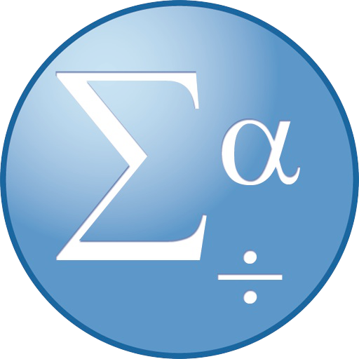
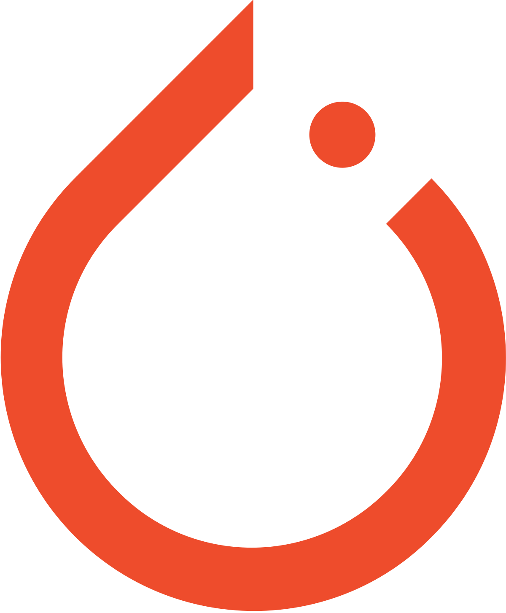
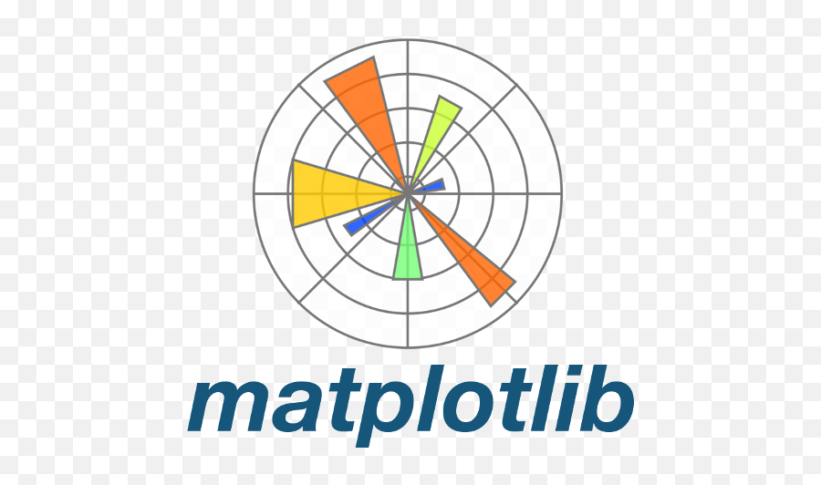
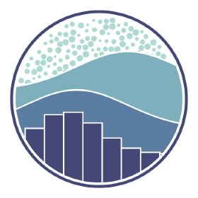
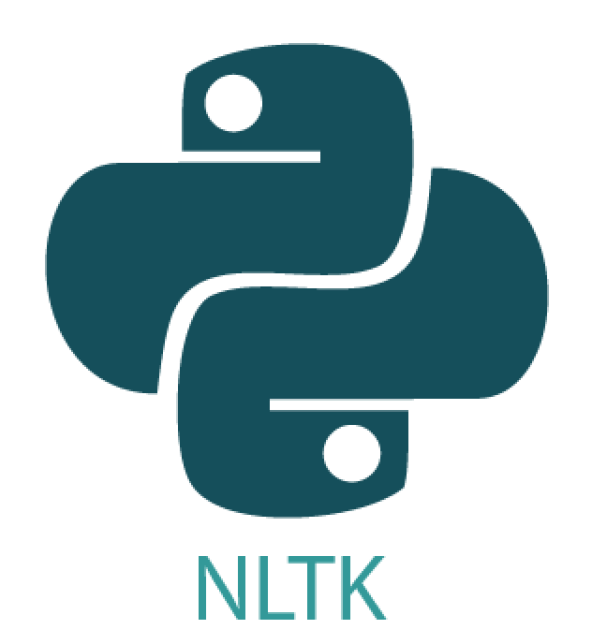
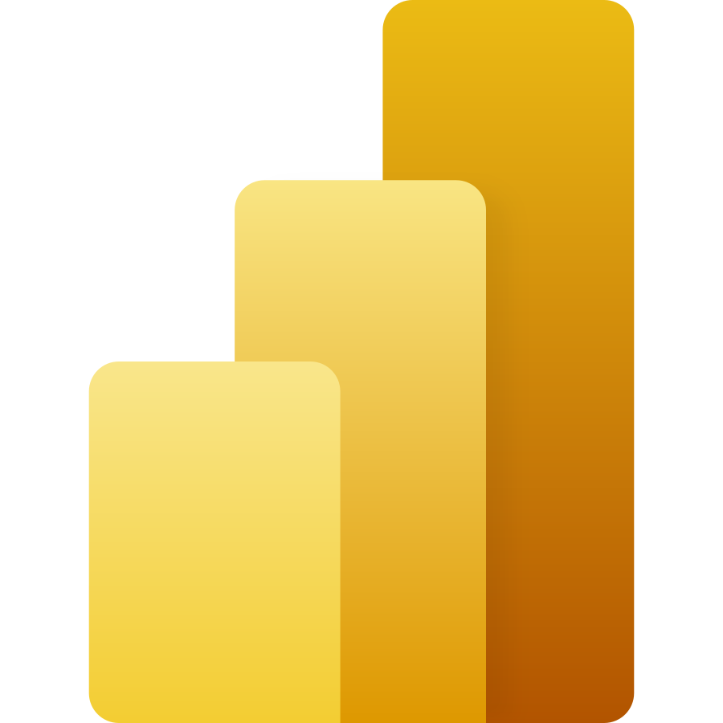

# Hi there, I'm Chandra Putra Ciptaningtyas 👋
  
  
  

## I'm an Aspiring Data Scientist, Machine Learning and AI Enthusiast, and a Fresh Graduate in Statistics

---
* 🔭 I’m currently working as a **Data Science Intern** at [Codveda Technologies](https://www.codveda.com), where I apply machine learning models to solve real-world problems.
* 🌱 I’m passionate about **Data Science**, **Machine Learning**, **Deep Learning**, and **AI** technologies.
* 📚 I’m actively contributing to open-source projects and looking for more collaboration opportunities in data science and machine learning.
* 🥅 2025 Goals: Further deepen my expertise in **Quantum Machine Learning**, **Time Series Analysis**, and **Natural Language Processing**.
* ⚡ **Fun fact**: When I'm not coding, I enjoy watching football, keeping up with football trends, cheering for **Chelsea FC**, exploring nature photography, building things, and reading biography books to learn from inspiring life stories.

---

## ⚡ Technologies I Use

### **Programming & Data Analysis Tools:**  
  

  <table align="center">
      <tr>
          <td align="center" width="140" height="112.43">
              
                Python
          </td>
          <td align="center" width="140" height="112.43">
              
                R
          </td>
          <td align="center" width="140" height="112.43">
              
                SQL
          </td>
          <td align="center" width="140" height="112.43">
              
                VS Code
          </td>
          <td align="center" width="140" height="112.43">
              
                Google Colab
          </td>
          <td align="center" width="140" height="112.43">
              
                Streamlit
          </td>
          <td align="center" width="140" height="112.43">
              
                RStudio
          </td>
      </tr>
      <tr>
          <td align="center" width="140" height="112.43">
              
                SPSS
          </td>
          <td align="center" width="140" height="112.43">
              
                Minitab
          </td>
          <td align="center" width="140" height="112.43">
              
                SAS
          </td>
          <td align="center" width="140" height="112.43">
              
                Eviews
          </td>
          <td align="center" width="140" height="112.43">
              
                MySQL
          </td>
          <td align="center" width="140" height="112.43">
              
                Oracle
          </td>
          <td align="center" width="140" height="112.43">
              
                SAP
          </td>
      </tr>
  </table>
  

### **Data Science & Machine Learning:**
  

  <table align="center">
      <tr>
          <td align="center" width="140" height="112.43">
              
                Scikit-learn
          </td>
          <td align="center" width="140" height="112.43">
              
                TensorFlow
          </td>
          <td align="center" width="140" height="112.43">
              
                PyTorch
          </td>
          <td align="center" width="140" height="112.43">
              
                Pandas
          </td>
          <td align="center" width="140" height="112.43">
              
                NumPy
          </td>
          <td align="center" width="140" height="112.43">
              
                Matplotlib
          </td>
          <td align="center" width="140" height="112.43">
              
                XGBoost
          </td>
      </tr>
      <tr>
          <td align="center" width="140" height="112.43">
              
                Seaborn
          </td>
          <td align="center" width="140" height="112.43">
              
                Scipy
          </td>
          <td align="center" width="140" height="112.43">
              
                Keras
          </td>
          <td align="center" width="140" height="112.43">
              
                NLTK
          </td>
          <td align="center" width="140" height="112.43">
              
                LightGBM
          </td>
      </tr>
  </table>
  

### **Data Analysis & Visualization:** 
  

  <table align="center">
      <tr>
          <td align="center" width="140" height="112.43">
              
                Excel
          </td>
          <td align="center" width="140" height="112.43">
              
                Google Sheets
          </td>
          <td align="center" width="140" height="112.43">
              
                Tableau
          </td>
          <td align="center" width="140" height="112.43">
              
                Power BI
          </td>
          <td align="center" width="140" height="112.43">
              
                Looker Studio
          </td>
      </tr>
  </table>
  

---

## 📊 My GitHub Stats

|  |  |
| ------------------------------------------------------------ | ------------------------------------------------------------ |
|  |                                                              |

---

## 🚀 Projects

- **[Portfolio Website](https://chandrapc3000.netlify.app):** A showcase of my data science and machine learning projects, including interactive visualizations.
- **[Disease Outbreak Prediction System](https://github.com/ChandraPC3000/disease-outbreak-prediction):** A time series prediction model for forecasting disease outbreaks.
- **[Stock Price Prediction Model](https://github.com/ChandraPC3000/stock-price-prediction):** A machine learning model to predict stock prices using historical data.

---

## 🖥️ My Laptop Setup

**Acer Nitro 5 AN515-57 - 71CV**  
**Display**: 15.6" FHD LED IPS 144Hz (1920x1080) Acer ComfyView™ LED-backlit TFT LCD  
**Processor**: Intel® Core™ i7-11800H processor (24MB cache, up to 4.60Ghz)  
**Memory**: 1x16GB DDR4  
**Storage**: 512GB SSD NVMe  
**Graphics**: NVIDIA® GeForce® RTX 3050 4GB GDDR6  
**Operating System**: Windows 11 Home + Office Home and Student  
**Networking**: Wi-Fi 6 AX201 Killer™ Ethernet E2600+ BT 5.1  
**Battery & Power adapter**: 180W  
**Weight**: 2.4KG  
**Camera**: Integrated Camera  
**Audio**: Dolby Audio Premium  
**Ports**:  
- 1x USB 3.2 Gen-2 featuring power-off USB charging  
- 2x USB 3.2 Gen-1  
- 1x HDMI® 2.0 port with HDCP support  
- 1x USB Type-C port (up to 10 Gbps)  
- 1x 3.5mm headphone/speaker jack  
- 1x DC-in jack for AC adapter  

---

## ⚡ Important Repository

💾 **365 Days of Computer Vision** - A comprehensive collection of daily Computer Vision learning exercises. [🔗](https://github.com/ChandraPC3000/365-Days-Computer-Vision-Learning-Linkedin-Post)

---

## 🤝 Let's Connect!

- **GitHub:** [ChandraPC3000](https://github.com/ChandraPC3000)
- **LinkedIn:** [Chandra Putra Ciptaningtyas](https://www.linkedin.com/in/chandra-putra-ciptaningtyas)
- **Instagram:** [@ciptaning.chan](https://www.instagram.com/ciptaning.chan)

---

### Thank you for visiting my profile! Feel free to connect or explore my projects! 🚀
